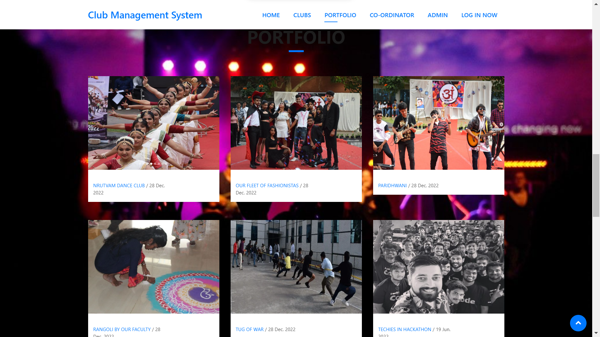
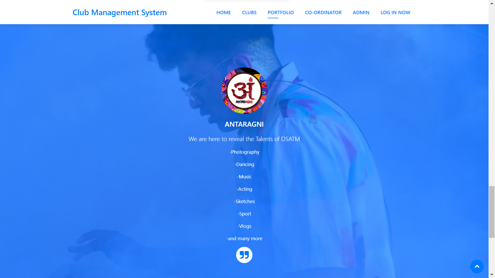

# Club Management System: Streamlining Participant and Co-ordinator Data with MySQL
This database management system provides immense value to club workshop organizers aiming to enhance their operations and effectively handle participants data. With its intuitive interface and robust functionalities, it presents an excellent solution for individuals seeking to efficiently organize and manage a thriving club events.
# Technology used :
phpmyadmin used for mysql database

php used for backend

html5, css, javascript and bootstrap4 for frontend

Xampp server
# Guidline :

step 1:- Install Xampp

step 2:- Open Xampp folder and paste the whole project inside htdocs folder

step 3:- Start Xampp server and start apache and mysql

step 4:- open phpmyadmin using this link http://localhost/phpmyadmin/ and create a database with name (dance) and name should be same otherwise it will show error

step 5:- inside the project folder a file is dance.sql is import in phpmyadmin inside dance database

step 6:- check your project http://localhost/cms/

step 7:- admin username :-admin and password : admin

if any query you can contact me at any time at linkedIn :- https://www.linkedin.com/in/ayush-kumar-72a6231b6/

If it is helpfull for you then, please give it a star

